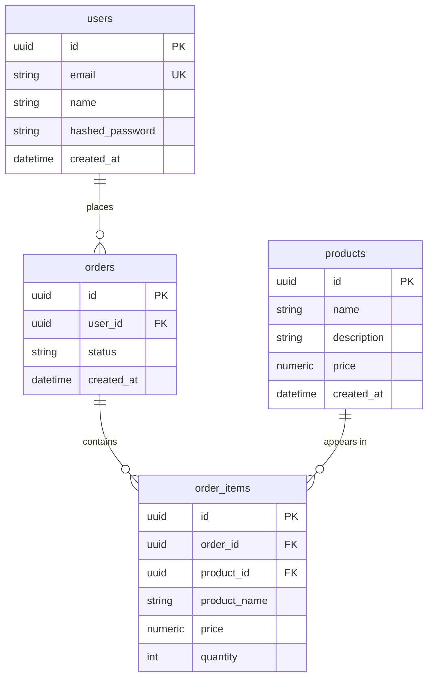
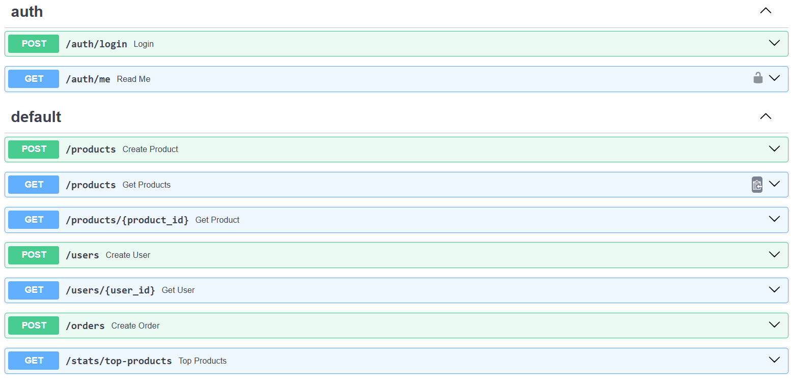
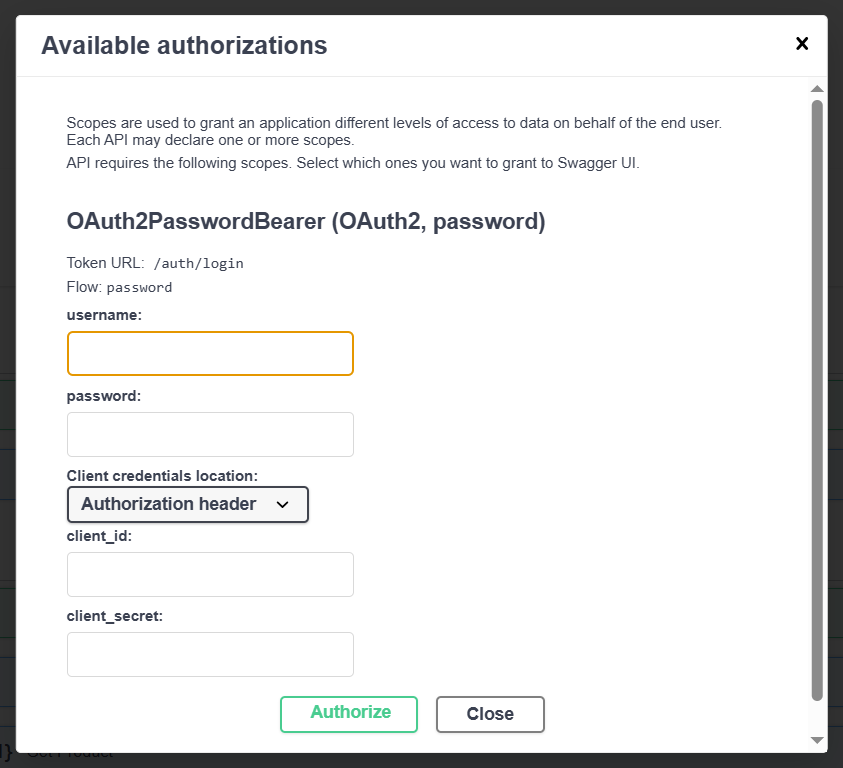

# Shop API


REST API для интернет-магазина на FastAPI. Управляет каталогом товаров, пользователями и заказами. Реализована JWT-авторизация, асинхронная работа с PostgreSQL, миграции через Alembic и автоматический прогон тестов в CI.

## Стек

- **FastAPI** — веб-фреймворк
- **PostgreSQL** — база данных
- **SQLAlchemy (async) + asyncpg** — ORM и драйвер
- **Alembic** — миграции схемы БД
- **Pydantic v2** — валидация и сериализация
- **JWT (python-jose)** — авторизация
- **Poetry** — управление зависимостями
- **Docker Compose** — запуск приложения и БД
- **pytest** — тесты
- **GitHub Actions** — CI

## Архитектура

```
HTTP-запрос
    ↓
routers/        — эндпоинты FastAPI
    ↓
services/       — бизнес-логика
    ↓
repositories/   — CRUD к БД
    ↓
models/         — SQLAlchemy-модели
    ↓
PostgreSQL
```

- **`routers/`** — принимают HTTP-запросы, валидируют через Pydantic, вызывают сервисы.
- **`services/`** — бизнес-логика: проверки, вычисления, вызовы репозиториев.
- **`repositories/`** — изолируют работу с БД. Сервисы не знают о SQLAlchemy-деталях.
- **`models/`** — SQLAlchemy-модели таблиц.
- **`schemas/`** — Pydantic-схемы: что приходит и что уходит через API.
- **`db/`** — подключение к PostgreSQL, async-сессия.
- **`auth/`** — хеширование паролей, JWT, зависимости авторизации.
- **`alembic/`** — миграции.
- **`main.py`** — точка входа: создаёт приложение, подключает роутеры, настраивает lifespan.

### Схема БД




## Установка и запуск

### Через Docker Compose (рекомендуется)

```bash
git clone https://github.com/xenoval/shop_api.git
cd shop_api
cp .env.example .env       # заполните SECRET_KEY
docker compose up --build
```

Приложение поднимется на `http://localhost:8000`. Swagger: `http://localhost:8000/docs`.

Применить миграции:

```bash
docker compose exec app alembic upgrade head
```

### Через Poetry (для локальной разработки)

1. Установите зависимости:

    ```bash
    poetry install
    ```

2. Поднимите PostgreSQL:

    ```bash
    docker compose up -d postgres postgres_test
    ```

3. Создайте `.env` по образцу `.env.example` и заполните `SECRET_KEY`.

4. Примените миграции:

    ```bash
    poetry run alembic upgrade head
    ```

5. Запустите приложение:

    ```bash
    poetry run uvicorn main:app --reload
    ```

Swagger будет доступен на `http://127.0.0.1:8000/docs`.

### Переменные окружения

| Переменная | Описание |
|---|---|
| `DATABASE_URL` | URL для приложения (`asyncpg`) |
| `ALEMBIC_DATABASE_URL` | URL для миграций (`psycopg2`) |
| `TEST_DATABASE_URL` | URL тестовой БД |
| `SECRET_KEY` | Секрет для подписи JWT |
| `ALGORITHM` | Алгоритм JWT (по умолчанию HS256) |
| `ACCESS_TOKEN_EXPIRE_MINUTES` | Время жизни токена |

## Эндпоинты

| Метод | Путь | Что делает | Авторизация |
|---|---|---|---|
| POST | `/users` | Создаёт пользователя | — |
| GET | `/users/{user_id}` | Один пользователь по ID | — |
| POST | `/auth/login` | Логин, возвращает JWT | — |
| GET | `/auth/me` | Текущий пользователь | ✅ Bearer |
| POST | `/products` | Создаёт товар | — |
| GET | `/products` | Список товаров с пагинацией | — |
| GET | `/products/{product_id}` | Один товар по ID | — |
| POST | `/orders` | Создаёт заказ | — |
| GET | `/stats/top-products` | Топ-5 товаров по продажам | — |


### Авторизация

Swagger с кнопкой **Authorize** для JWT:





## Тесты

```bash
poetry run pytest -v
```

Покрытие:

```bash
poetry run pytest --cov=. --cov-report=term-missing
```

Тесты используют отдельную БД (`TEST_DATABASE_URL`) и поднимаются через Docker-сервис `postgres_test`. Между тестами таблицы очищаются.

## Архитектурные решения

### PostgreSQL для всех сущностей

Изначально проект использовал polyglot persistence: MySQL для пользователей и заказов, MongoDB для товаров. В процессе рефакторинга я перенесла всё в PostgreSQL:

- Товары имеют предсказуемую структуру (`name`, `description`, `price`), которая хорошо ложится в реляционную модель.
- Транзакции при создании заказа проще, когда все данные в одной БД.
- Меньше инфраструктуры — проще деплой и тесты.

MongoDB была бы оправдана, если бы у товаров были сильно разные наборы полей (например, техника vs одежда). В текущей модели это не так.

### Асинхронный SQLAlchemy

Проект использует `asyncpg` и `AsyncSession`. FastAPI работает в async-режиме, и блокирующие запросы к БД свели бы на нет преимущества async. Все операции с БД — через `await`.

### Слои services и repositories

Сервисы не ходят в БД напрямую — только через репозитории. Это даёт:

- **Тестируемость**: репозиторий легко замокается в юнит-тестах.
- **Единая точка бизнес-логики**: роутеры тонкие, вся логика в сервисах.
- **Изоляция от ORM**: если завтра сменим SQLAlchemy на что-то другое, правим только репозитории.

### JWT вместо сессий

API stateless — JWT хорошо ложится в REST. Токен подписывается `SECRET_KEY`, содержит `sub` (id пользователя) и `exp`. Хеширование паролей — `bcrypt`.

### Alembic вместо create_all

Схема БД управляется миграциями, а не `Base.metadata.create_all()`. Это позволяет:

- Версионировать изменения схемы.
- Откатывать миграции.
- Применять изменения на проде без дропа таблиц.

Alembic работает через синхронный `psycopg2`, приложение — через async `asyncpg`. Это стандартная практика: Alembic не поддерживает async-драйверы напрямую.

### Снапшот цены и имени в order_items

В `order_items` хранятся `product_name` и `price` на момент заказа, а не только `product_id`. Это осознанно: товар может измениться или быть удалён, а заказ должен сохранить историческую правду.

## Что было сложного

1. **Перенос хранилища.** Изначально товары жили в MongoDB, пользователи и заказы — в MySQL. Переход на единый PostgreSQL потребовал переписать модели, схемы, роутеры, запросы и переписать тесты. Самое сложное было не потерять работающие куски по пути.

2. **Смешение sync и async.** SQLAlchemy имеет sync и async API. Сначала роутеры были sync (`def`, `Session`), а движок — async (`AsyncSession`). Это вызывало странные ошибки. Пришлось привести всё к async и разобраться с event loop'ами.

3. **Асинхронные тесты.** Подружить pytest-asyncio, `NullPool`, event loop'ы и тестовую БД.

## Планы

- Роли пользователей (продавец, покупатель, админ)
- Refresh-токены
- Оформление заказа с проверкой остатков на складе
- Кэширование каталога в Redis

## Автор

xenoval